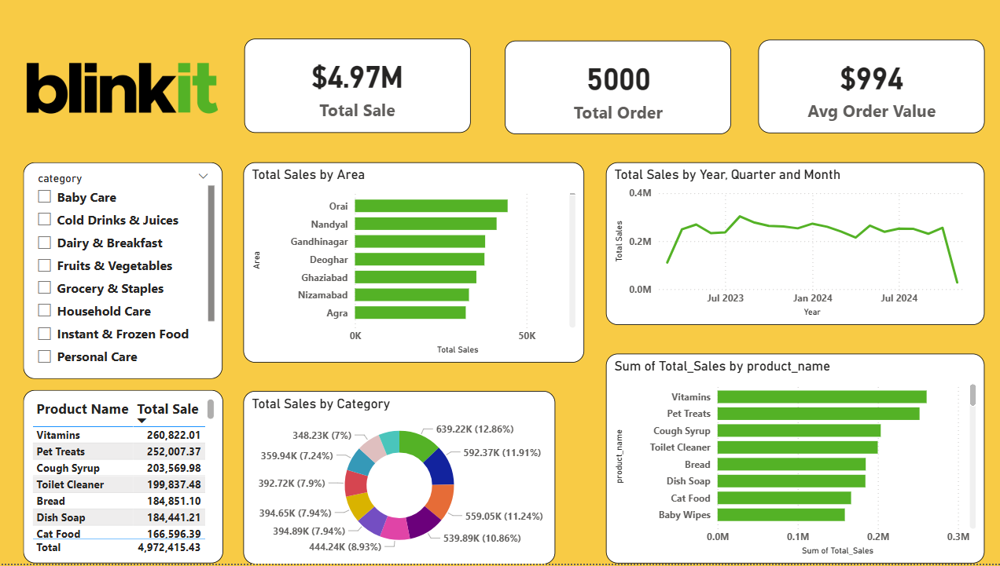

# 🛒 Blinkit Sales Analysis Dashboard

## 📌 Project Overview
This project analyzes Blinkit sales data to identify key business insights such as product performance, customer demand, and regional sales trends.

## 🛠️ Tools Used
- Python (Pandas, NumPy)
- Data Cleaning & Transformation
- Power BI (Dashboard)

## 📊 Key Insights
- Identified top-selling products contributing to revenue
- Analyzed sales distribution across different cities
- Evaluated category-wise sales contribution
- Observed sales trends over time

## 📸 Dashboard Preview

## 🎯 Conclusion
This project helps businesses understand sales patterns and make data-driven decisions to improve performance and optimize product strategy.# 🛒 Blinkit Sales Analysis Dashboard
